[](https://ollama.ai)

**FinAgentX: An autonomous on-chain AI bank using the official Tether WDK & Gemma 2B to evaluate risk, issue undercollateralized USDT loans, and manage debt. A self-sovereign economic actor providing trustless credit scoring and automated repayment collection using WDK-powered self-custody.**

---

## 🏗️ Architecture

```mermaid
sequenceDiagram
    participant B as Borrower (Frontend)
    participant A as Autonomous Agent (Node.js)
    participant LM as LoanManager (Contract)
    participant LP as LendingPool (Contract)
    participant ML as ML Engine (Python)
    participant LLM as Gemma 2B (Ollama)

    B->>LM: requestLoan(amount, duration, "USDT")
    LM-->>A: Event: LoanRequested
    
    rect rgb(30, 40, 60)
        Note over A: Autonomous Reasoning Loop
        A->>LM: getBorrowerProfile()
        A->>ML: evaluateRisk(features)
        ML-->>A: default_prob, credit_score
        A->>LLM: negotiateTerms(riskData)
        LLM-->>A: recommended_terms, explanation
    end

    alt Approved
        A->>LM: approveLoan(loanId, interest, explanation)
        LM->>LP: allocateFunds(borrower, amount)
        LP->>B: Transfer USDT
    else Rejected
        A->>LM: rejectLoan(loanId, reason)
    end

    Note over A: Monitoring Period
    loop Every 60s
        A->>LM: checkDueDate(loanId)
        alt Due
            A->>LM: collectRepayment(loanId)
            LM->>LP: returnFunds(borrower, totalDue)
        end
    end
```



---

## 📁 Project Structure

```
FinAgentX/
├── contracts/
│   ├── LendingPool.sol       # Liquidity pool (Sepolia USDT)
│   ├── LoanManager.sol       # Core lending logic + loan lifecycle
│   └── CreditScore.sol       # DID-based on-chain credit identity
├── scripts/
│   └── deploy.js             # Hardhat deploy (pauses for private key!)
├── agent/
│   ├── index.js              # 🤖 Main autonomous loop (12 steps)
│   ├── wdk.js                # WDK wallet + contract interface
│   ├── mcp.js                # MCP tool definitions
│   ├── llm.js                # Ollama Gemma:2b integration
│   ├── riskEngine.js         # ML feature generation + inference
│   ├── treasury.js           # Self-growing capital manager
│   ├── did.js                # DID-linked credit identity
│   ├── behaviorDetector.js   # Suspicious activity detection
│   └── agentMarket.js        # Agent-to-agent marketplace
├── ml/
│   ├── generate_dataset.py   # Synthetic 10k borrower dataset
│   ├── train.py              # Train all 4 models
│   ├── ensemble.py           # Weighted ensemble predictor
│   ├── continuous_learning.py # On-chain outcome retraining
│   ├── api.py                # FastAPI inference server
│   └── requirements.txt
├── frontend/
│   └── src/
│       ├── App.jsx
│       ├── components/
│       │   ├── Dashboard.jsx         # Live stats + charts
│       │   ├── LoanRequest.jsx       # Borrow + ML preview
│       │   ├── AgentMonitor.jsx      # 12-step loop viewer
│       │   ├── RiskVisualizer.jsx    # Interactive ML analysis
│       │   └── AgentMarketplace.jsx  # Agent-to-agent lending
│       └── hooks/
│           ├── useWallet.js          # MetaMask hook
│           └── useAgent.js           # WebSocket + REST hook
├── hardhat.config.js
├── package.json
└── .env.example
```

---

## 🔧 Prerequisites

| Tool | Version | Notes |
|------|---------|-------|
| Node.js | ≥18 | For agent + frontend |
| Python | ≥3.10 | For ML engine |
| MetaMask | Latest | Browser extension |
| Ollama | Any | With `gemma:2b` pulled |
| Sepolia ETH | ≥0.05 | For deployment gas |

---

## 🚀 Setup Instructions

### Step 1 — Clone & Install

```bash
# Install root dependencies (Hardhat, ethers)
cd d:/Projects/FinAgentX
npm install

# Install agent dependencies
cd agent && npm install && cd ..

# Install frontend dependencies
cd frontend && npm install && cd ..

# Install Python ML dependencies
cd ml && pip install -r requirements.txt && cd ..
```

### Step 2 — Environment Variables

```bash
# Copy the template
cp .env.example .env

# Edit .env and fill in:
# SEPOLIA_RPC_URL=https://sepolia.infura.io/v3/YOUR_KEY
# PRIVATE_KEY=your_deployer_private_key
# AGENT_MNEMONIC="your twelve word bip39 seed phrase here"
# ETHERSCAN_API_KEY=optional
```

> 💡 **Tip:** The agent now uses the official **Tether WDK** for autonomous signing. If you don't have a mnemonic, the agent will generate one on first run (check the logs for the unique address).

### Step 3 — Train ML Models

```bash
# Generate synthetic dataset (10,000 borrowers)
cd ml && python generate_dataset.py

# Train all 4 models (Linear, Ridge, Lasso, RandomForest)
python train.py

# Start the ML inference API
python api.py
# → Running at http://localhost:8000
```

### Step 4 — Compile Contracts (no deployment yet)

```bash
cd d:/Projects/FinAgentX
npx hardhat compile
```

### Step 5 — Deploy to Sepolia

> ⚠️ **Make sure your `.env` has `PRIVATE_KEY` and `SEPOLIA_RPC_URL` set before running this.**

```bash
npm run deploy:sepolia
```

The script will:
1. ⏸️ **Pause** and show a confirmation prompt
2. Check your ETH balance (needs ≥0.05 Sepolia ETH)
3. Deploy: `CreditScore` → `LendingPool` → `LoanManager`
4. Wire all permissions
5. Save `deployed-addresses.json` (copied to `agent/` and `frontend/src/`)

### Step 6 — Start the Agent

```bash
# Make sure Ollama is running in WSL:
# wsl -- ollama serve   (if not already running)

# Start the autonomous agent
cd agent && npm start
# → REST API: http://localhost:3001
# → WebSocket: ws://localhost:3001
```

### Step 7 — Start the Frontend

```bash
cd frontend && npm run dev
# → http://localhost:5173
```

---

## 🧠 ML Ensemble Logic

```
final_score = 0.10 × linear
            + 0.20 × ridge
            + 0.20 × lasso
            + 0.50 × random_forest   ← PRIMARY

IF default_prob > 0.60:
    REJECT
ELSE:
    APPROVE

IF model_variance > 0.02:
    reduce_loan_amount(up to 40%)
    increase_interest_rate(up to 5%)
```

### Continuous Learning Pipeline

```
Synthetic Dataset (10k) → Initial Training
         ↓
  On-Chain Outcomes  → Appended to CSV (weighted 3×)
         ↓
  Runtime Retraining → Every 20 new events
```

---

## ⚙️ Dynamic Interest Rate

```
rate = BASE_RATE (500 bps = 5%)
     + default_prob × 2500            (risk premium)
     + uncertainty_premium (up to 500 bps)
     − credit_discount (max 250 bps)
```

---

## 🔄 Autonomous Agent Loop

The agent runs 24/7 with this 12-step loop:

| Step | Action |
|------|--------|
| 1 | Listen for `LoanRequested` on-chain events |
| 2 | Fetch borrower credit data via **Tether WDK** |
| 3 | Generate ML features from on-chain data |
| 4 | Run all 4 ML models in parallel |
| 5 | Combine with weighted ensemble |
| 6 | Run behavioral risk detection |
| 7 | Compute uncertainty + confidence adjustments |
| 8 | Call Gemma 2B for negotiation + explanation |
| 9 | Decide: APPROVE / REJECT / ADJUST |
| 10 | Execute on-chain via **Tether WDK** (BIP-39 Self-Custodial) |
| 11 | Monitor repayments; liquidate overdue loans |
| 12 | Reallocate capital with treasury optimizer |

---

## 📊 USDT on Sepolia

```
Contract: 0x3B94E36181875d97183227e86dFa30bb61641adE (MockUSDT)
Network:  Ethereum Sepolia Testnet (chainId: 11155111)
Source:   FinAgentX Mock USDT (Seeded with 500k liquidity for testing)
```

To get testnet USDT: [Circle faucet](https://faucet.circle.com) or swap Sepolia ETH on a testnet DEX.

---

## 🔐 Security Notes

- Never commit your `.env` file (it's in `.gitignore`)
- The agent wallet (`AGENT_PRIVATE_KEY`) only needs to be funded with Sepolia ETH for gas
- All USDT operations require explicit `approve()` from the borrower wallet
- Smart contracts use `ReentrancyGuard` and `Ownable` from OpenZeppelin

---

## 🏆 Hackathon — Galáctica WDK Edition

**Track:** 💰 Lending Bot (Primary) | 🤖 Agent Wallets (WDK Integration)  
**Stack:** WDK · MCP · Ollama Gemma:2b · Ethereum Sepolia · Scikit-learn · Fastapi  
**Key Features:**
- ✅ Fully autonomous 12-step agent loop
- ✅ ML ensemble with 4 models + uncertainty estimation
- ✅ Real-time continuous learning from on-chain outcomes
- ✅ Confidence-aware dynamic interest rates
- ✅ DID-based persistent credit identity
- ✅ Agent-to-agent lending marketplace
- ✅ Self-growing treasury with automatic reinvestment
- ✅ Behavioral anomaly detection
- ✅ LLM-driven negotiation and explanation
- ✅ Real Sepolia USDT (no mocks)

---

*Built with ❤️ for Hackathon Galáctica: WDK Edition*
